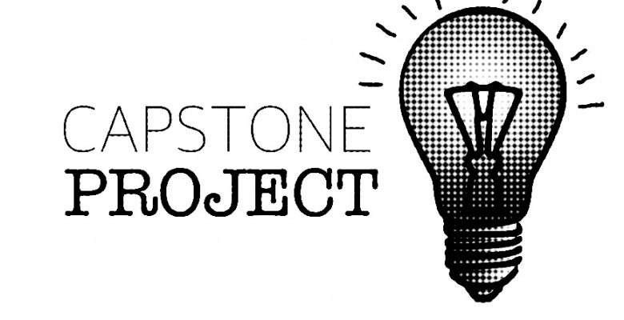

  <!-- You are encouraged to replace this logo with your own! Otherwise you can also remove it. -->
  
   

  <h3><b>1st Capstone Project Of Microverse (Module One)</b></h3>

 
<!-- TABLE OF CONTENTS -->

# 📗 Table of Contents

- [📖 About the Project](#about-project)
  - [🛠 Built With](#built-with)
    - [Tech Stack](#tech-stack)
    - [Key Features](#key-features)
  - [🚀 Live Demo](#live-demo)
 - [📺 Presentation](#presentation) 
- [💻 Getting Started](#getting-started)
  - [Setup](#setup)
  - [Prerequisites](#prerequisites)
  - [Install](#install)
  - [Run tests](#run-tests)
- [👥 Authors](#authors)
- [🤝 Contributing](#contributing)
- [⭐️ Show your support](#support)
- [🙏 Acknowledgements](#acknowledgements)
- [📝 License](#license)

# 📖 [Capstone-project] 

>🔊 This website is a web development course that was inspired from a conference website CC-Global-Summit of 2015 designed by [cindy Shin](https://www.behance.net/gallery/29845175/CC-Global-Summit-2015)
## 🛠 Built With 

### Tech Stack 

  
Client

  <ul>
    <li><a href="https://developer.mozilla.org/en-US/docs/Web/HTML">Html</a></li>
    <li><a href="https://developer.mozilla.org/en/docs/Web/CSS">Css</a></li>
    <li><a href="https://www.javascripttutorial.net">JavaScript</a></li>
  </ul>

<!-- Features -->

### Key Features 

- **Implement Linters**
- **Implement Github flow**
- **Implement mobile version**

(<a href="#readme-top">back to top</a>)

<!-- LIVE DEMO -->

## 🚀 Live Demo 

- [Live Demo On Github Pages](https://aminederbal.github.io/capstone-project-1/)

(<a href="#readme-top">back to top</a>)

## 📺 Presentation 
- [loom Presentation](https://www.loom.com/share/02ee9e93b7d94a529a51cf7895990787)

(<a href="#readme-top">back to top</a>)

<!-- GETTING STARTED -->

## 💻 Getting Started 

To get a local copy up and running, follow these steps.

### Prerequisites

**In order to run this project you need:**

### Setup

Clone this repository to your desired folder: use command line

git clone https://github.com/AmineDerbal/capstone-project-1.git

### Install

Install the dependencies with the command line :

npm install

### Run tests

To run tests, run the following command:

npx hint . "to check html css and javascript linter errors" Refer to this [Documentation]("https://github.com/microverseinc/linters-config/tree/master/html-css-js) for information how to check styles error

(<a href="#readme-top">back to top</a>)

## 👥 Authors 

👤 **Derbal Amine**

- GitHub: [github](https://github.com/AmineDerbal)
- LinkedIn: [LinkedIn](https://www.linkedin.com/in/mohammed-el-amine-derbal-4038541b6/)

(<a href="#readme-top">back to top</a>)

<!-- CONTRIBUTING -->

## 🤠Contributing 

Contributions, issues, and feature requests are welcome!

Feel free to check the issues page

(<a href="#readme-top">back to top</a>)

<!-- SUPPORT -->

## ⭐️ Show your support 

If you like this project please give it a ⭐

(<a href="#readme-top">back to top</a>)

<!-- ACKNOWLEDGEMENTS -->

## 🙠Acknowledgments 

- [the whole Microverse Community](https://www.microverse.org/)
- [Cindy shin](https://www.behance.net/gallery/29845175/CC-Global-Summit-2015) for this wonderful design

(<a href="#readme-top">back to top</a>)

<!-- LICENSE -->

## 📠License 

This project is [MIT](./LICENCE) licensed.

(<a href="#readme-top">back to top</a>)
